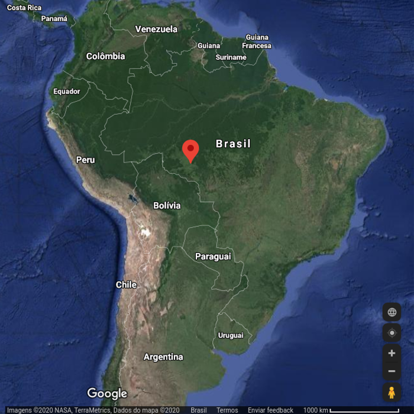

### A temperature dashboard built with Django

This dashboard application was created with the intent to practice django and implement a dashboard for a IoT device.
The device was created to measure the temperature on a city in the middle of the Amazon rain forest, which is a very hot place, like very hot and with virtually the same temperature the entire year.

Other measurements were taken, like the temperature in a barbecue grill.

**City**: Cacoal, state of Rondônia, Brazil

The Cacoal location

**Device**:
- ESP8266;
- Water proof DS18B20. (Air temperature)
- Type K Thermocouple with a MAX6675 module. (Barbecue grill)

##### Soon~~, maybe not that soon,~~ the application will be online and the URL will be placed here.